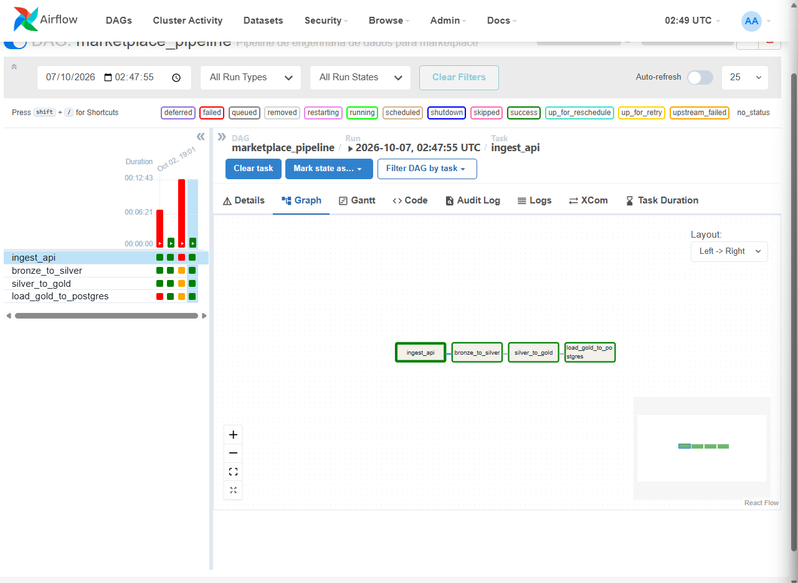

# Marketplace Data Engineering Pipeline

Projeto de Engenharia de Dados desenvolvido para construir um pipeline completo de ingestão, transformação, armazenamento e orquestração de dados de produtos de um marketplace.

O projeto utiliza uma API pública como fonte de dados e processa as informações seguindo uma arquitetura em camadas Bronze, Silver e Gold.

## Arquitetura do Projeto

Fluxo do pipeline:

```text
DummyJSON API
      ↓
Bronze - JSON
      ↓
Silver - Parquet
      ↓
Gold - Parquet
      ↓
PostgreSQL
      ↓
Apache Airflow
```

## Tecnologias Utilizadas

- Python
- Apache Spark / PySpark
- Apache Airflow
- PostgreSQL
- Docker
- Docker Compose
- Apache Parquet
- Git

## Fonte de Dados

Os dados são obtidos através da API pública DummyJSON.

Endpoint utilizado:

```text
https://dummyjson.com/products?limit=0
```

Na execução validada do projeto, foram ingeridos 194 produtos.

## Camada Bronze

A camada Bronze armazena os dados brutos recebidos da API em formato JSON.

Arquivo gerado:

```text
data/data_lake/bronze/products.json
```

Nesta etapa, os dados são mantidos o mais próximos possível da fonte original.

## Camada Silver

A camada Silver realiza a leitura dos dados da camada Bronze utilizando PySpark e prepara os campos utilizados nas etapas seguintes do pipeline.

Os dados tratados são armazenados em formato Parquet.

Arquivo gerado:

```text
data/data_lake/silver/products.parquet
```

Na execução validada do projeto, foram processados 194 registros.

## Camada Gold

A camada Gold realiza agregações por categoria de produto.

As métricas calculadas são:

- quantidade de produtos;
- preço médio;
- menor preço;
- maior preço.

Os resultados são armazenados em formato Parquet.

Arquivo gerado:

```text
data/data_lake/gold/category_metrics.parquet
```

Na execução validada, foram processadas 24 categorias.

## PostgreSQL

Os dados da camada Gold são carregados em um banco PostgreSQL.

Tabela utilizada:

```text
gold_category_metrics
```

Na execução validada do pipeline, 24 linhas foram carregadas no banco.

## Orquestração com Apache Airflow

O Apache Airflow é responsável por controlar e executar todas as etapas do pipeline.

A DAG principal é:

```text
marketplace_data_pipeline
```

A sequência de tarefas é:

```text
ingest_api
    ↓
bronze_to_silver
    ↓
silver_to_gold
    ↓
load_gold_to_postgres
```

Cada tarefa é executada somente após a conclusão da etapa anterior.

## Estrutura do Projeto

```text
airflow-docker/
│
├── dags/
│   └── marketplace_pipeline.py
│
├── data/
│   ├── ingestion/
│   │   └── ingest_api.py
│   │
│   ├── spark_jobs/
│   │   ├── bronze_to_silver.py
│   │   └── silver_to_gold.py
│   │
│   └── database/
│       └── load_gold_to_postgres.py
│
├── Dockerfile
├── docker-compose.yaml
├── .env.example
├── .gitignore
└── README.md
```

## Variáveis de Ambiente

O projeto utiliza variáveis de ambiente para configuração e conexão com o banco de dados.

Um arquivo de exemplo está disponível em:

```text
.env.example
```

Para executar o projeto, crie um arquivo `.env` baseado nesse modelo e configure suas próprias credenciais.

O arquivo `.env` não é versionado no Git por questões de segurança.

## Como Executar o Projeto

### 1. Clonar o repositório

```bash
git clone https://github.com/arlen64/marketplace-data-pipeline.git
```

### 2. Entrar na pasta do projeto

```bash
cd marketplace-data-pipeline
```

### 3. Criar o arquivo de variáveis de ambiente

Utilize o arquivo `.env.example` como referência para criar o seu arquivo `.env`.

### 4. Iniciar os containers

```bash
docker compose up -d
```

### 5. Verificar o status dos serviços

```bash
docker compose ps
```

### 6. Acessar o Apache Airflow

Abra no navegador:

```text
http://localhost:8080
```

### 7. Executar a DAG

No Airflow, localize e execute:

```text
marketplace_data_pipeline
```

## Resultado do Pipeline

O pipeline foi validado com sucesso de ponta a ponta.

Resultados da execução:

- 194 produtos ingeridos da DummyJSON;
- 194 registros processados na camada Silver;
- 24 categorias processadas na camada Gold;
- 24 linhas carregadas no PostgreSQL;
- todas as tarefas da DAG executadas com sucesso no Apache Airflow.

## Tratamento de Falhas

A etapa de ingestão utiliza:

- tratamento de exceções;
- validação da resposta da API;
- validação de lista vazia;
- retry automático para falhas HTTP;
- logging das etapas de execução.

Isso evita que o pipeline continue quando a fonte retorna dados inválidos ou quando ocorre uma falha de comunicação.

## Evidência da Execução

Execução completa da DAG no Apache Airflow:



## Aprendizados

Durante o desenvolvimento deste projeto foram trabalhados conceitos importantes de Engenharia de Dados, como:

- ingestão de dados via API REST;
- tratamento de falhas e retries;
- processamento com PySpark;
- armazenamento em formato Parquet;
- arquitetura de dados em camadas;
- integração com PostgreSQL;
- orquestração com Apache Airflow;
- utilização de Docker e Docker Compose;
- uso de variáveis de ambiente;
- versionamento com Git e GitHub;
- construção de um pipeline de dados de ponta a ponta.

## Autor

Projeto desenvolvido como parte dos meus estudos e construção de portfólio em Engenharia de Dados.